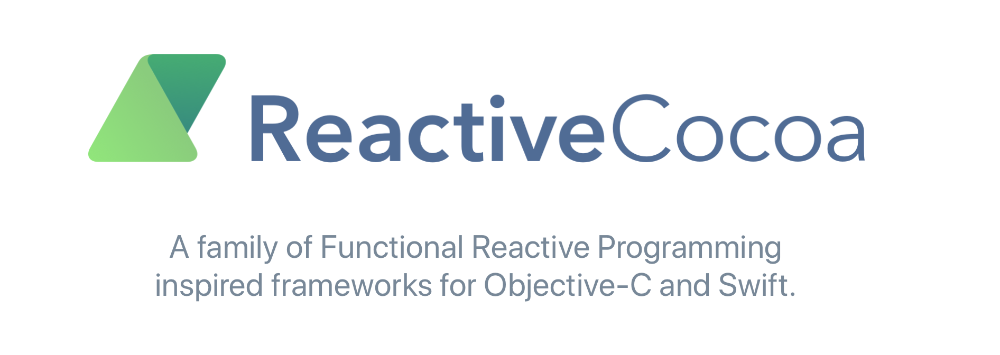
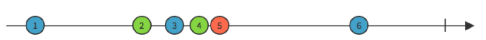

### 1. ReactiveCocoa简介
ReactiveCocoa简称RAC，是由GitHub开源的一个受到 **函数响应式编程（ functional reactive programming）（RFP）** 思想启发的的oc框架，提供形成和转化信息流的API。    
RAC有一个主要的优点,就是提供了一个单一的，统一的方法去处理异步的行为,包括delegate方法,blocks回调,target-action机制,notifications和KVO.
#### 1.1 响应式编程   
不需要考虑调用顺序，只需要知道考虑结果，类似于蝴蝶效应，产生一个事件，会影响很多东西，这些事件像流一样的传播出去，然后影响结果。  
 
 * 非响应式编程  
 
```
int b = 1;
int c = 2;
int a = b + c; // a = 3
b = 2;        // a = 3,b = 2
```
 * 响应式编程  
 
```
int b = 1;
int c = 2;
int a := b + c; // a = 3
b = 2;        // a = 4, = 2
```

* 代表：KVO    

```
- (void)addObserver:(NSObject *)observer 
         forKeyPath:(NSString *)keyPath   
            options:(NSKeyValueObservingOptions)options  
            context:(nullable void *)context;
            
- (void)observeValueForKeyPath:(NSString *)keyPath 
                      ofObject:(id)object  
                        change:(NSDictionary<NSKeyValueChangeKey,id> *)change 
                        context:(void *)context
```


#### 1.2 函数式编程
函数式编程中，函数可以像其他变量一样当作函数的参数和返回值。可以抽取很多常用操作，作为高阶函数。比如filter、map、reduce等等。好处是这些高阶函数可以随意组合使用，从而实现复杂的功能，并且代码还能保证可读性。

```
>>> f = abs
def add(x, y, f):
    return f(x) + f(y)
    
    
>>> def f(x):
     return x * x
>>> map(f, [1, 2, 3, 4, 5, 6, 7, 8, 9])
[1, 4, 9, 16, 25, 36, 49, 64, 81]
  
```
#### 1.3 RAC
有了函数式编程和响应式编程两种思想后，RAC还需要一种基本处理对象——**RACSignal**。我们平时编程处理的都是变量，RAC处理的是由RACSignal捕获的信息流。RAC把app中的一些事件和行为当作信息流来处理。比如输入字符，点击按钮，网络请求等等。
  

把事件转化成信息流之后，结合函数式编程和响应式编程，我们就可以对这些信息流进行一系列的操作，关心这些信息流的对象可以订阅（subscribe）它们，从而决定自己的行为。使代码解耦合。
### 2. rac框架概述
#### Streams
#### Signals
#### Subscription
#### Subjects
#### Commans
#### Sequences
#### Disposables
### 3. RACSignal
#### 协议 RACSubscriber 

遵循这个协议的对象需要实现下面三个方法，对应接受三种值。

```
- (void)sendNext:(id)value;  

- (void)sendError:(NSError *)error;

- (void)sendCompleted;
```

#### 创建RACSignal
```
- (RACSignal *)recordWholesaseOperateSignal{
    return [RACSignal createSignal:^RACDisposable *(id<RACSubscriber> subscriber) {
        [JYXBBaseRequestTool post:path params:param success:^(id responseData, NSInteger code, NSString *msg, NSURLSessionDataTask *task) {
            if (code == RETURN_CODE_OK) {
                [subscriber sendNext:@"true"];
                [subscriber sendCompleted];
            } else {
                NSError *error = [NSError errorWithDomain:@"error.jyxb.pay" code:code userInfo:@{NSLocalizedDescriptionKey:msg}];
                [subscriber sendError:error];
            }
        } failure:^(NSError *error) {
            [subscriber sendError:error];
        }];
        return nil;
    }];
}
```

#### RACSignal (Subscription)  

```
- (RACDisposable *)subscribe:(id<RACSubscriber>)subscriber;

- (RACDisposable *)subscribeNext:(void (^)(id x))nextBlock 
                           error:(void (^)(NSError *error))errorBlock 
                       completed:(void (^)(void))completedBlock;

- (RACDisposable *)subscribeNext:(void (^)(id x))nextBlock 
                           error:(void (^)(NSError *error))errorBlock           
                       completed:(void (^)(void))completedBlock;
```

```
[recordWholesaseOperateSignal subscribeNext:^(id x) {
        nslog(@"%@",x);
        //do something
    }];
```
### 4. RACCommand
### 5. 系统类拓展
### 6. 高阶函数
### 7. 常用的宏
### 8. 实例

* merge combine
* RacCommand的几个signal  