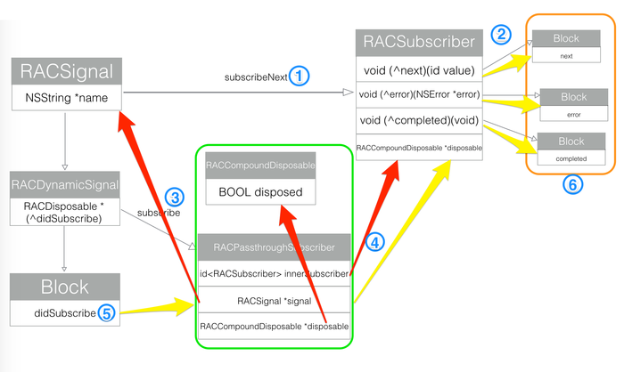

### 1. ReactiveCocoa简介
ReactiveCocoa简称RAC，是由GitHub开源的一个受到 **函数响应式编程（ functional reactive programming）（RFP）** 思想启发的的oc框架，提供形成和转化信息流的API。    
RAC有一个主要的优点,就是提供了一个单一的，统一的方法去处理异步的行为,包括delegate方法,blocks回调,target-action机制,notifications和KVO.
#### 1.1 响应式编程   
不需要考虑调用顺序，只需要知道考虑结果，类似于蝴蝶效应，产生一个事件，会影响很多东西，这些事件像流一样的传播出去，然后影响结果。  
 
 * 非响应式编程  
 
```
int b = 1;
int c = 2;
int a = b + c; // a = 3
b = 2;        // a = 3,b = 2
```
 * 响应式编程  
 
```
int b = 1;
int c = 2;
int a := b + c; // a = 3
b = 2;        // a = 4, = 2
```

* 代表：KVO    

```
- (void)addObserver:(NSObject *)observer 
         forKeyPath:(NSString *)keyPath   
            options:(NSKeyValueObservingOptions)options  
            context:(nullable void *)context;
            
- (void)observeValueForKeyPath:(NSString *)keyPath 
                      ofObject:(id)object  
                        change:(NSDictionary<NSKeyValueChangeKey,id> *)change 
                        context:(void *)context
```


#### 1.2 函数式编程
函数式编程中，函数可以像其他变量一样当作函数的参数和返回值。可以抽取很多常用操作，作为高阶函数。比如filter、map、reduce等等。好处是这些高阶函数可以随意组合使用，从而实现复杂的功能，并且代码还能保证可读性。

```
>>> f = abs
def add(x, y, f):
    return f(x) + f(y)
    
    
>>> def f(x):
     return x * x
>>> map(f, [1, 2, 3, 4, 5, 6, 7, 8, 9])
[1, 4, 9, 16, 25, 36, 49, 64, 81]
  
```
#### 1.3 RAC
有了函数式编程和响应式编程两种思想后，RAC还需要一种基本处理对象——**RACSignal**。我们平时编程处理的都是变量，RAC处理的是由RACSignal捕获的信息流。RAC把app中的一些事件和行为当作信息流来处理。比如输入字符，点击按钮，网络请求等等。
  

把事件转化成信息流之后，结合函数式编程和响应式编程，我们就可以对这些信息流进行一系列的操作，关心这些信息流的对象可以订阅（subscribe）它们，从而决定自己的行为。使代码解耦合。

### 2. RACSignal
#### 创建RACSignal
```
- (RACSignal *)recordWholesaseOperateSignal{
    return [RACSignal createSignal:^RACDisposable *(id<RACSubscriber> subscriber) {
        [JYXBBaseRequestTool post:path params:param success:^(id responseData, NSInteger code, NSString *msg, NSURLSessionDataTask *task) {
            if (code == RETURN_CODE_OK) {
                [subscriber sendNext:@"true"];
                [subscriber sendCompleted];
            } else {
                NSError *error = [NSError errorWithDomain:@"error.jyxb.pay" code:code userInfo:@{NSLocalizedDescriptionKey:msg}];
                [subscriber sendError:error];
            }
        } failure:^(NSError *error) {
            [subscriber sendError:error];
        }];
        return nil;
    }];
}
```
#### 协议 RACSubscriber 

遵循这个协议的对象需要实现下面三个方法，对应接受三种值。

```
- (void)sendNext:(id)value;  

- (void)sendError:(NSError *)error;

- (void)sendCompleted;
```

#### 订阅RACSignal (Subscription)

```
- (RACDisposable *)subscribe:(id<RACSubscriber>)subscriber;

- (RACDisposable *)subscribeNext:(void (^)(id x))nextBlock 
                           error:(void (^)(NSError *error))errorBlock 
                       completed:(void (^)(void))completedBlock;


```

```
[recordWholesaseOperateSignal subscribeNext:^(id x) {
        nslog(@"%@",x);
        //do something
    }];
```
### 3. RACCommand
### 4. 系统类拓展
### 5. 高阶函数(operator)
#### map
map方法用来转换数据流，形成一个新的数据流，不改变数据的个数。

```
RACSequence *letters = [@"A B C D E F G H I" componentsSeparatedByString:@" "].rac_sequence;

// Contains: AA BB CC DD EE FF GG HH II
RACSequence *mapped = [letters map:^(NSString *value) {
    return [value stringByAppendingString:value];
}];

```

#### fitler
fiter方法用来顾虑数据流，筛选出符合条件的数据，通常数据的个数会改变。

```
RACSequence *numbers = [@"1 2 3 4 5 6 7 8 9" componentsSeparatedByString:@" "].rac_sequence;

// Contains: 2 4 6 8
RACSequence *filtered = [numbers filter:^ BOOL (NSString *value) {
    return (value.intValue % 2) == 0;
}];

```  
#### concat
concat方法用来连接数据流，对普通数据流的操作。

```
RACSequence *letters = [@"A B C D E F G H I" componentsSeparatedByString:@" "].rac_sequence;
RACSequence *numbers = [@"1 2 3 4 5 6 7 8 9" componentsSeparatedByString:@" "].rac_sequence;

// Contains: A B C D E F G H I 1 2 3 4 5 6 7 8 9
RACSequence *concatenated = [letters concat:numbers]

```

#### faltten
falten方法把 数据 是 数据流的数据流 转换成 数据 是 普通数据的数据流，对数据流的数据流的操作。

```
RACSequence *letters = [@"A B C D E F G H I" componentsSeparatedByString:@" "].rac_sequence;
RACSequence *numbers = [@"1 2 3 4 5 6 7 8 9" componentsSeparatedByString:@" "].rac_sequence;
RACSequence *sequenceOfSequences = @[ letters, numbers ].rac_sequence;

// Contains: A B C D E F G H I 1 2 3 4 5 6 7 8 9
RACSequence *flattened = [sequenceOfSequences flatten];

```

#### falttenMap
先map后fatten  

```
RACSequence *numbers = [@"1 2 3 4 5 6 7 8 9" componentsSeparatedByString:@" "].rac_sequence;

// Contains: 1 1 2 2 3 3 4 4 5 5 6 6 7 7 8 8 9 9
RACSequence *extended = [numbers flattenMap:^(NSString *num) {
    return @[ num, num ].rac_sequence;
}];

```
作用 

```
 [[[self.signInButton
    rac_signalForControlEvents:UIControlEventTouchUpInside]
    flattenMap:^id(id x) {
      return [self signInSignal];
    }]
    subscribeNext:^(NSNumber *signedIn) {
     
    }];
```

#### merge
合并多个数据流到一个数据流中  
用处： 多个没有依赖关系的网络请求  

```
RACSequence *numbers = [@"1 2 3 4 5 6 7 8 9" componentsSeparatedByString:@" "].rac_sequence;

// Contains: 1 1 2 2 3 3 4 4 5 5 6 6 7 7 8 8 9 9
RACSequence *extended = [numbers flattenMap:^(NSString *num) {
    return @[ num, num ].rac_sequence;
}];

```
#### combineLatset
 多个信号绑定在一起生成一个新的信号，只有在每个被绑定的信号都发出数据后，新信号才会发出值，   
 用处：多个网络请求必须都完成之后才能进行下一步操作。
 
 ```
 RACSubject *letters = [RACSubject subject];
RACSubject *numbers = [RACSubject subject];
RACSignal *combined = [RACSignal
    combineLatest:@[ letters, numbers ]
    reduce:^(NSString *letter, NSString *number) {
        return [letter stringByAppendingString:number];
    }];

// Outputs: B1 B2 C2 C3
[combined subscribeNext:^(id x) {
    NSLog(@"%@", x);
}];

[letters sendNext:@"A"];
[letters sendNext:@"B"];
[numbers sendNext:@"1"];
[numbers sendNext:@"2"];
[letters sendNext:@"C"];
[numbers sendNext:@"3"];

 ```

### switchToLatest 
 应用在信号的信号上，只会转发最新的信号的数据。
 
 ```
RACSubject *letters = [RACSubject subject];
RACSubject *numbers = [RACSubject subject];
RACSubject *signalOfSignals = [RACSubject subject];

RACSignal *switched = [signalOfSignals switchToLatest];

// Outputs: A B 1 D
[switched subscribeNext:^(NSString *x) {
    NSLog(@"%@", x);
}];

[signalOfSignals sendNext:letters];
[letters sendNext:@"A"];
[letters sendNext:@"B"];

[signalOfSignals sendNext:numbers];
[letters sendNext:@"C"];
[numbers sendNext:@"1"];

[signalOfSignals sendNext:letters];
[numbers sendNext:@"2"];
[letters sendNext:@"D"];

 ```
### 6. 常用的宏

* RACObserve() 


```
[[RACObserve(self.viewModel, isWholesaleTransfer) distinctUntilChanged] subscribeNext:^(id x) {

 }];
```
* RAC（）

```
  [[validPasswordSignal map:^id(id value) {
        return [value boolValue] ? [UIColor clearColor] : [UIColor yellowColor];
    }] subscribeNext:^(UIColor *color) {
        self.usernameTextField.backgroundColor = color;
    }];

  RAC(self.usernameTextField, backgroundColor) =
    [validUsernameSignal
      map:^id(NSNumber *passwordValid) {
       return [passwordValid boolValue] ? [UIColor clearColor] : [UIColor yellowColor];
     }];
      
```

### 7. 实例
### 8. RAC基于Block的实现
> For example, a text field can be bound to the latest time, even as it changes, instead of using additional code that watches the clock and updates the text field every second. It works much like KVO, but with blocks instead of overriding -observeValueForKeyPath:ofObject:change:context:



* 1. RACSignal调用subscribeNext方法，新建一个RACSubscriber。
* 2. 新建的RACSubscriber会copy，nextBlock，errorBlock，completedBlock存在自己的属性变量中。
* 3. RACSignal的子类RACDynamicSignal调用subscribe方法。
* 4. 新建RACCompoundDisposable和RACPassthroughSubscriber对象。RACPassthroughSubscriber分别保存对RACSignal，RACSubscriber，RACCompoundDisposable的引用，注意对RACSignal的引用是unsafe_unretained的。
* 5. RACDynamicSignal调用didSubscribe闭包。先调用RACPassthroughSubscriber的相应的sendNext，sendError，sendCompleted方法。
* 6. RACPassthroughSubscriber再去调用self.innerSubscriber，即RACSubscriber的nextBlock，errorBlock，completedBlock。注意这里调用同样是先copy一份，再调用闭包执行。


### 9. 推荐资料
* [https://www.raywenderlich.com/62699/reactivecocoa-tutorial-pt1](https://www.raywenderlich.com/62699/reactivecocoa-tutorial-pt1)
> RAC教程，内容安排比较合理且比较全面，不像其他教程有头没尾的。

* [https://github.com/ReactiveCocoa/ReactiveObjC/#when-to-use-reactiveobjc](https://github.com/ReactiveCocoa/ReactiveObjC/#when-to-use-reactiveobjc)
> 官方文档，权威全面。

* [https://www.jianshu.com/p/d7d951a99db8](https://www.jianshu.com/p/d7d951a99db8)
> 介绍ReactiveCocoa 中 RACSignal 是如何发送信号的，RAC基于Block的实现。

